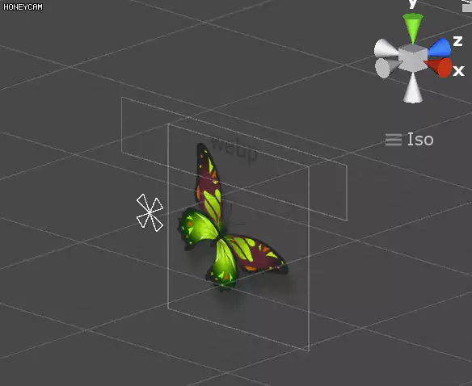

# What's this?

 This project was based in [octo-code/webp-unity3d](https://github.com/octo-code/webp-unity3d).

 I decided that there should be a simpler way and I created **unity.webp**, a plugin that helps you to use [webp](https://developers.google.com/speed/webp/) in your Unity3d projects in a clear and easy way and works in **iOS, Android, Windows, Linux** projects.

# Watchout
* currently, not support ios-simulator. but it is easy to add if you have a little effort.

# The fast track
 All you have to do to start using it in your project:

1. [Download this .unitypackage from Release Page](https://github.com/netpyoung/unity.webp/releases), extract its content on your Unity3D Project. It contains the dlls that Unity3d will need to access webp.
4. **You’re done!**

# Example
If you want to try it I've uploaded a small example that you will be able to find in the `example` folder. Download the folder and open it with Unity3d to give it a try. It contains classes that will help you to start.

# Acknowledgements
This project is based on the work of:

- [octo-code/webp-unity3d](https://github.com/octo-code/webp-unity3d) - License: Apache License - see https://github.com/octo-code/webp-unity3d/blob/master/LICENSE

# Etc.
* https://en.wikipedia.org/wiki/Lenna
* android ndk - https://github.com/android-ndk/ndk/wiki
 - android-ndk-r15c-darwin-x86_64.zip

# Demo

# LICENCE

## webp

* BSD

# TODO
* refactoring
* SafeHandle
